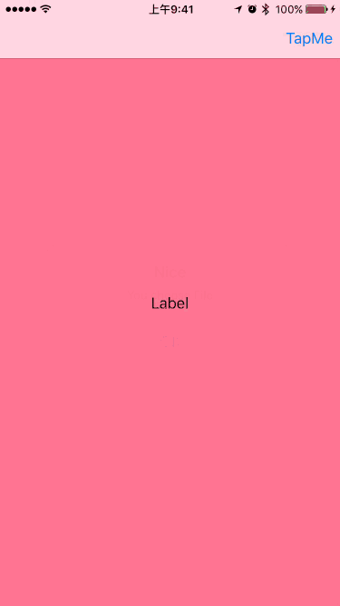

[](https://github.com/Carthage/Carthage)

 DropdownMenu is a dropdown menu for navigationController in Swift, It  can be associated in any place if have a navigationController
 
 

## Features
- **Only text cell**
- **Image and text cell**
- **Highlight cell**
- **Seleted cell**
- **Detail accessory cell**

## Requirements

- iOS 8.0
- Xcode 7.3+

## Communication

- If you **need help**, please add issues. or send email to <zhangxiaolian1991@gmail.com>

## Installation

> **Embedded frameworks require a minimum deployment target of iOS 8

### Carthage

[Carthage](https://github.com/Carthage/Carthage) is a decentralized dependency manager that builds your dependencies and provides you with binary frameworks.

You can install Carthage with [Homebrew](http://brew.sh/) using the following command:

```bash
$ brew update
$ brew install carthage
```

To integrate DropdownMenu into your Xcode project using Carthage, specify it in your `Cartfile`:

    github "teambition/DropdownMenu"

Run `carthage update` to build the framework 

At last, you need to set up your Xcode project manually to add the DropdownMenu framework.

On your application targets’ “General” settings tab, in the “Linked Frameworks and Libraries” section, drag and drop each framework you want to use from the Carthage/Build folder on disk.

On your application targets’ “Build Phases” settings tab, click the “+” icon and choose “New Run Script Phase”. Create a Run Script with the following content:

     /usr/local/bin/carthage copy-frameworks
    
and add the paths to the frameworks you want to use under “Input Files”:

     $(SRCROOT)/Carthage/Build/iOS/DropdownMenu.framework

For more information about how to use Carthage, please see its [project page](https://github.com/Carthage/Carthage)


## Usage

### Import framework to your class

```swift
import DropdownMenu

```

### Add code for your action

#### Without  Section

```swift
func showMenu(sender: UIBarButtonItem) {
        let item1 = DropdownItem(title: "NO Image")
        let item2 = DropdownItem(image: UIImage(named: "file")!, title: "File")
        let item3 = DropdownItem(image: UIImage(named: "post")!, title: "Post", style: .Highlight)
        let item4 = DropdownItem(image: UIImage(named: "post")!, title: "Event", style: .Highlight, accessoryImage: UIImage(named: "accessory")!)

        let items = [item1, item2, item3, item4]
        let menuView = DropdownMenu(navigationController: navigationController!, items: items, selectedRow: selectedRow)
        menuView.delegate = self
        menuView.showMenu()
    }
```

#### With Section

```swift
 @IBAction func showMenu(_ sender: UIBarButtonItem) {
        let item1 = DropdownItem(title: "NO Image")
        let item2 = DropdownItem(image: UIImage(named: "file")!, title: "File")
        let item3 = DropdownItem(image: UIImage(named: "post")!, title: "Post", style: .highlight)
        let item4 = DropdownItem(image: UIImage(named: "post")!, title: "Event", style: .highlight, accessoryImage: UIImage(named: "accessory")!)
        
        let section0 = DropdownSection(sectionIdentifier: "Teambition", items: [item1, item2])
        let section1 = DropdownSection(sectionIdentifier: "Space", items: [item3, item4])

        let menuView = DropdownMenu(navigationController: navigationController!, sections: [section0, section1], selectedIndexPath: selectedIndexPath)
        menuView?.delegate = self
        menuView?.showMenu()
    }
```

### Handle delegate

```swift
extension ViewController: DropdownMenuDelegate {
    func dropdownMenu(dropdownMenu: DropdownMenu, didSelectRowAtIndexPath indexPath: NSIndexPath) {
        print("DropdownMenu didselect \(indexPath.row)")
    }
}
```

for detail, Please check the demo

## License

DropdownMenu is released under the MIT license. 

